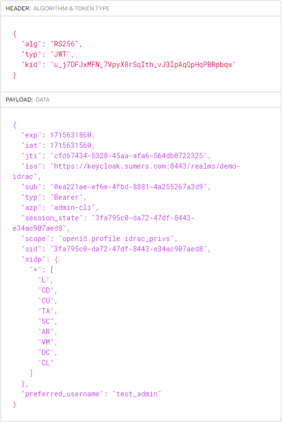
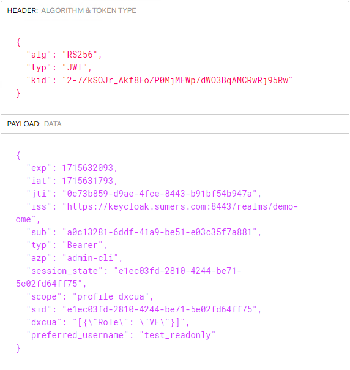

# Claims
- [iDRAC Claims](#idrac-claims)
- [Example iDRAC JWT](#example-idrac-jwt)
- [OME Claims](#ome-claims)
- [Example OME JWT](#example-ome-jwt)

## iDRAC Claims
```
Required Client Scopes: 
    - idrac_privs
    - openid
    - profile

Required Claim: xidp
value:  {"*":["L", "CD", "CU", "TA","SC","AR","VM","DC","CL"]}

Values Defined:
    "L",  // "loginToDRAC"
    "CD", // "configureDRAC"
    "CU", // "configureUsers"
    "CL", // "clearLogs"
    "SC", // "executeServerControlCommands"
    "AR", // "accessConsoleRedirection"
    "VM", // "accessVirtualMedia"
    "TA", // "testAlerts"
    "DC", // "executeDiagnosticCommands"
```

## Example iDRAC JWT


## OME Claims
```
Required Claim: dxcua
value: [{"Role": "AD"}] || [{"Role": "DM", "Entity":"Group1"}]

Values Defined:
- Role: 
    "AD" // "administrator"
    "DM" // "device manager"
    "VE" // "viewer/readonly"
- Entity:
    "Group1" // "device group name" 
```

## Example OME JWT
