# Step by Step
- [Walkthrough for iDRAC](#configuring-keycloak-with-idrac)
- [Walkthrough for OME](#configuring-keycloak-with-ome)

## Configuring KeyCloak with iDRAC
1. **Access KeyCloak Administration Console**, by logging in with the `KEYCLOAK_ADMIN` Credentials designated during the container's deployment. 
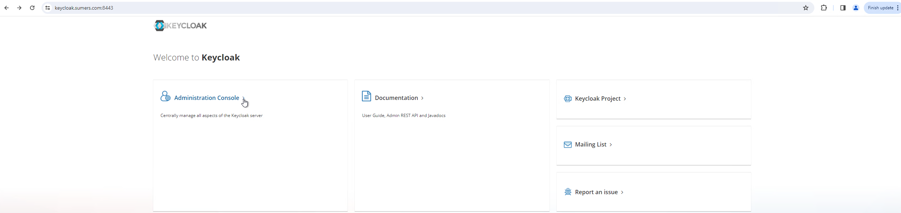
2. **Navigate to the the "demo-idrac" realm** within the console. 
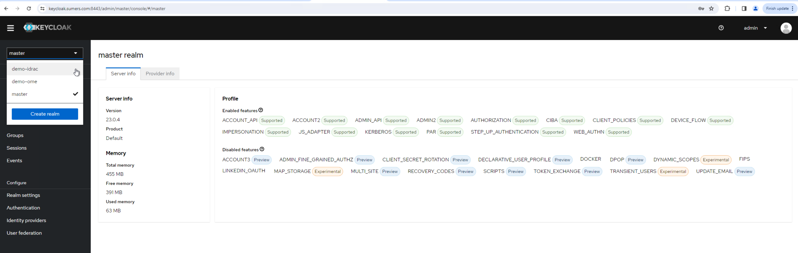
3. **Proceed to add a user** to the Realm. 
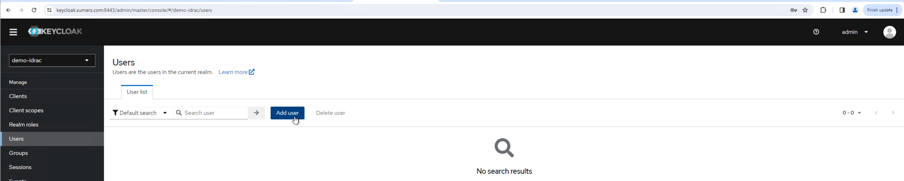
4. **Add the new user to one of the pre-established permission groups**. For additional details on tailoring permissions, refer to the [CLAIMs](./CLAIMS.md) documentation.
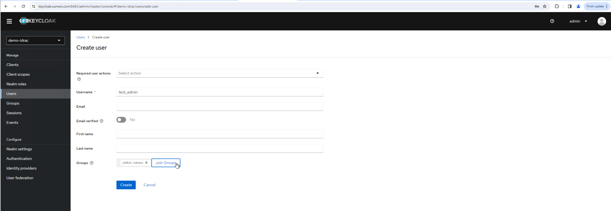
5. **Assign credentials to the newly added user**
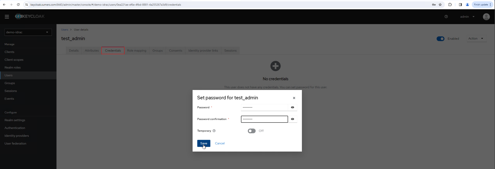
6. **Generate an Initial Access Token for the purpose of client registration**. Ensure the 'Count' value corresponds to the total number of clients (iDRACs) inteded for registration. 
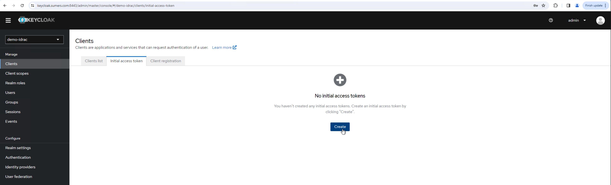
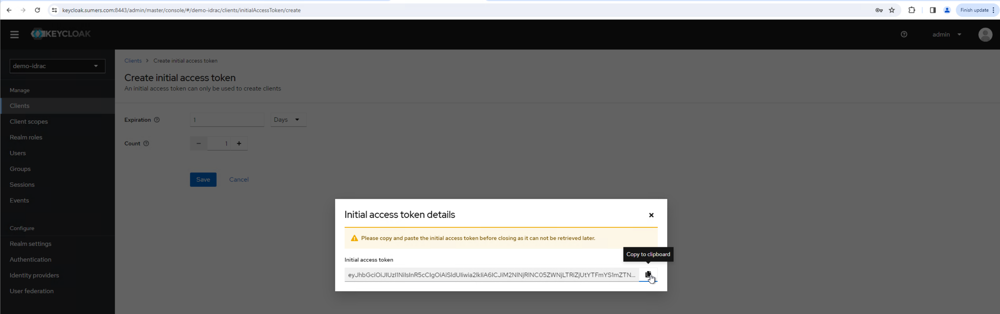
7. **Register the KeyCloak instance as an OIDC Provider through the iDRAC Web UI**. This procedure can be streamlined via Redfish, as detailed [here](../README.md#configuring-dell-idracs).
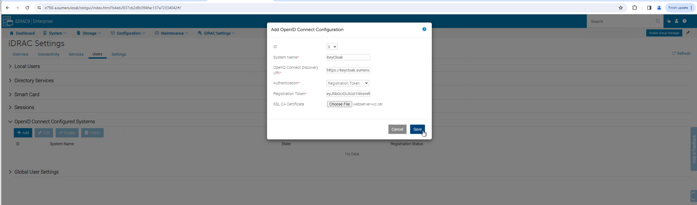
8. **Confirm the successful registration of the provider**, which will typically occur within a few minutes. 
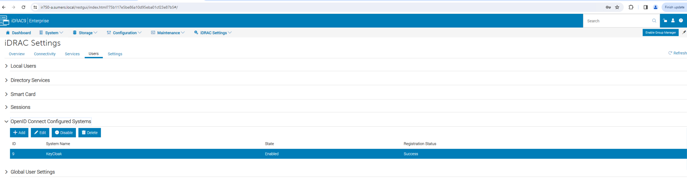
9. **The iDRAC login interface will subsequently present an option** to sign in using the 'Provider'.  

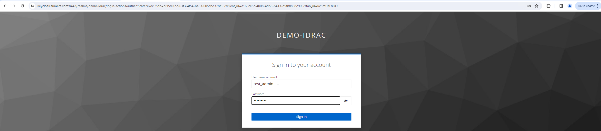
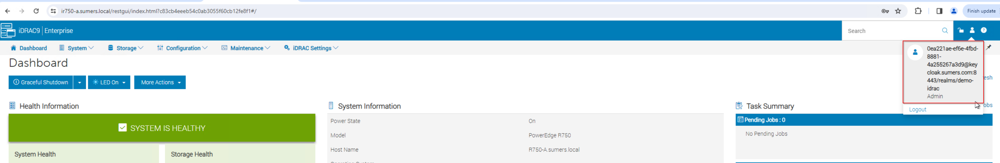

## Configuring KeyCloak with OME
1. **Access KeyCloak Administration Console**, by logging in with the `KEYCLOAK_ADMIN` Credentials designated during the container's deployment. 

2. **Navigate to the the "demo-ome" realm** within the console. 

3. **Proceed to add a user** to the Realm, joining one of the predefined permision groups. For additional details on tailoring permissions, refer to the [CLAIMs](./CLAIMS.md) documentation.
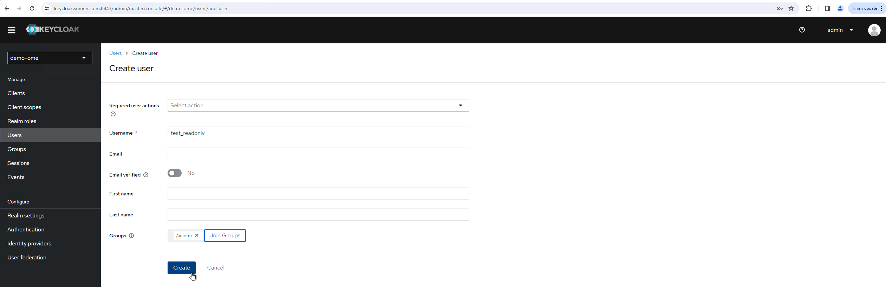
4. **Generate an Initial Access Token for the purpose of client registration** 
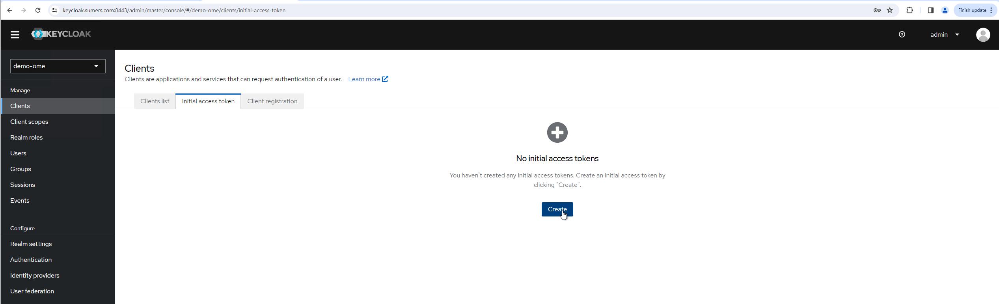
5. **Register the KeyCloak instance as an OIDC Provider through the OME Web UI**. This procedure can be streamlined via Redfish, as detailed [here](../README.md#configuring-dell-openmanage-enterprise).
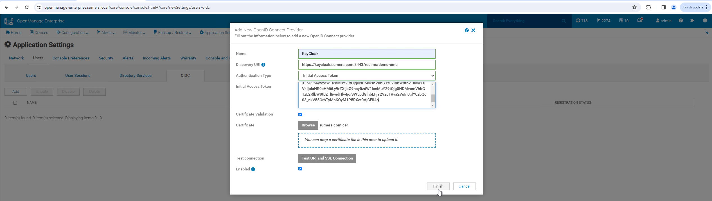
6. **Confirm the successful registration of the provider**
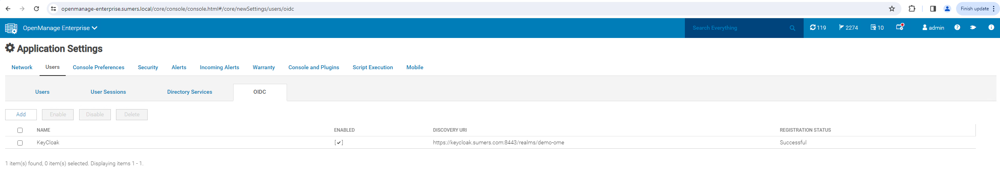
7. **The OME Login page will subsiquently present an option** to sign in with 'Provider'.
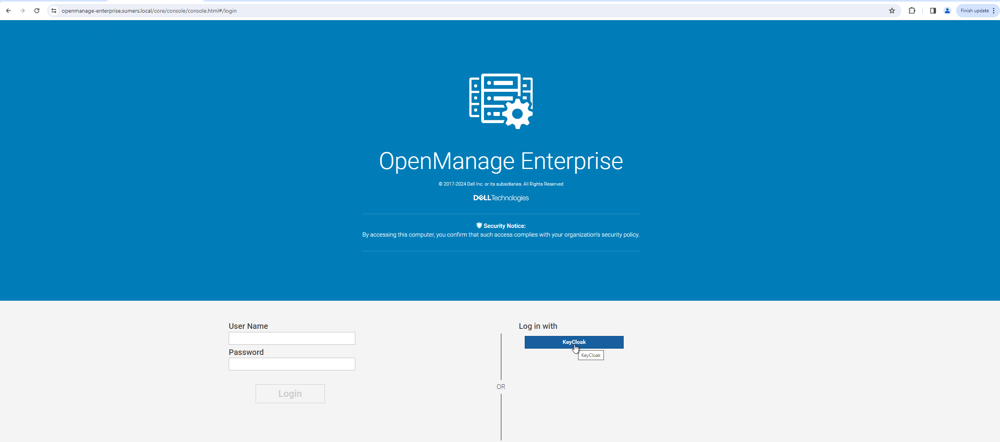
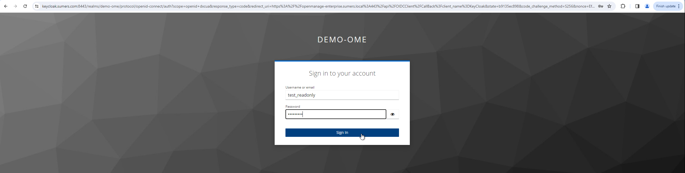
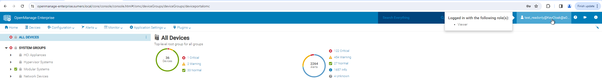